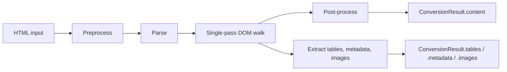

# Conversion pipeline

Every call to `convert()` runs the same five-stage pipeline. There is no second pass and no separate analysis phase.

## 1. Preprocessing

Scripts and styles are stripped with a fast byte-scanner pass before parsing begins. If the `preprocess` option is `true`, navigation elements (`<nav>`, plus `<header>` / `<footer>` / `<aside>` that carry navigation hints in their class or id) are also dropped.

The preprocessing pass is conservative — it only removes elements that would never contribute to text output. See the [Configuration → Preprocessing](../configuration.md#preprocessing) section for the exact rules.

## 2. Parsing

The HTML is parsed by [html5ever](https://crates.io/crates/html5ever), the same WHATWG-spec-compliant parser used by Servo. The parser builds an in-memory tree rooted at a document node and applies browser-compatible error recovery so malformed input degrades gracefully.

Metadata extraction (`<title>`, `<meta>`, `<link>`, Open Graph, JSON-LD, …) runs in a separate fast pass using [astral-tl](https://crates.io/crates/astral-tl), a high-performance tokenizer.

The library does not stream: the entire HTML is parsed before the DOM walk starts. For very large documents (multi-MB) this is the dominant memory cost.

## 3. Single-pass DOM walk

The walk is pre-order. For every node, an element-specific handler appends to the output buffer. The same traversal:

- Writes Markdown to a `String` buffer.
- Dispatches to the registered [`HtmlVisitor`](plugin-system.md) (if any) and applies the returned `VisitResult`.
- Collects `<table>` elements into `result.tables`.
- Collects inline images into `result.images` (when `extract_images` is enabled).
- Builds `result.document` when `include_document_structure` is enabled.

There is no intermediate AST. The output buffer grows steadily; the only cost is the parsed DOM and the growing string.

## 4. Post-processing

Whitespace normalization, trailing-newline cleanup, reference-style link definition collection, and format-specific tweaks (Djot or plain text) are applied to the accumulated output buffer. This stage runs once on the final string and is cheap.

## 5. Extraction assembly

Tables, inline images, metadata, and document structure are assembled into the final `ConversionResult`:

| Field      | Type                        | Populated when                            |
| ---------- | --------------------------- | ----------------------------------------- |
| `content`  | `Option<String>`            | always (None only for extraction-only)    |
| `metadata` | `HtmlMetadata`              | always (feature `metadata` enabled)       |
| `tables`   | `Vec<TableData>`            | always                                    |
| `images`   | `Vec<InlineImage>`          | `extract_images: true`                    |
| `document` | `Option<DocumentStructure>` | `include_document_structure: true`        |
| `warnings` | `Vec<ProcessingWarning>`    | always (non-fatal issues during the walk) |

## Output formats

The same pipeline produces all three output formats. The `output_format` option only changes the rendering handlers in stage 3:

- **Markdown** (default) — CommonMark-compatible.
- **Djot** — uses `*emphasis*` and `_strong_` instead of Markdown's asterisk-doubling.
- **Plain** — strips all markup, link targets, and list markers; returns visible text only.

--8<-- "snippets/feedback.md"
